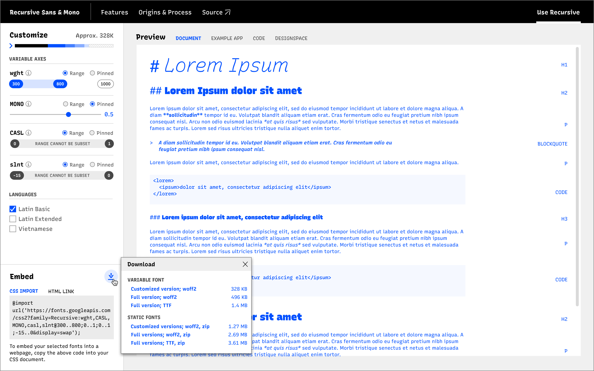

# GUAC: GF URL API2 Configurator

Prototyping for a URL configuration flow on the Recursive minisite for the Google Fonts API v2.

## Purpose

### Specific purpose of this repo

This is intended to be a short-use repo before I start integrating these ideas into the actual [Recursive minisite repo](https://github.com/arrowtype/recursive-minisite). This repo is basically a CodePen, but with a bit more control.

Based on [deventy](https://github.com/ianrose/deventy), a starter for [11ty](https://www.11ty.io/).

### Ultimate purpose of this tool

Create a tool to make it easy and understandable for users to request what they want from the Google Fonts API, v2, for multi-axis variable fonts.

Here's a basic mockup of what I have in mind. It will require further iteration to fully work:



This is described in more depth at https://github.com/arrowtype/recursive-minisite/issues/33.

## Develop

```
npm install
```

then

```
npm run dev
```
